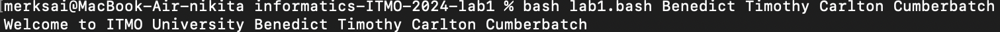

## Лабораторная работа 1

1. Создаем новый файл с именем `lab1.bash`.

2. Откройте созданный файл `lab1.bash` для редактирования с помощью `nano`.

3. Указываем интепретатор скрипта для ОС.

4. Выводим приветсвие командой `echo` с использованием специальной переменной `$*`, которая представляет все введенные аргументы в виде одной строки.

5. Сохраняем файл. Закрываем текстовый редактор `nano`. Запускаем bash-скрипт, и в терминале отображается нужная строка.

